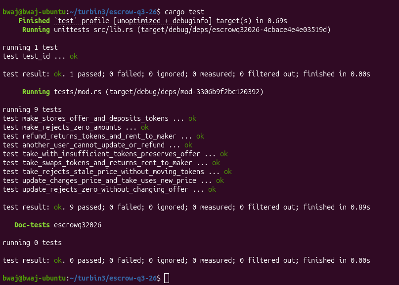

# Token Escrow — Turbin3 Q3 Builders 2026

An Anchor program for atomic token swaps, built for the Week 2 Vault and Escrow assignment. A maker deposits token A and specifies an amount of token B to receive. A taker can accept the offer, or the maker can update the requested amount or refund their deposit.

## Instructions

| Instruction | Signer | Behavior |
| --- | --- | --- |
| `make(seed, deposit, receive, expiration)` | Maker | Creates the escrow state and token vault, stores the offer, and deposits token A. Deposit and receive amounts must be positive. |
| `take(expected_receive)` | Taker | Checks the expected price, transfers token B to the maker, releases the vault's token A to the taker, and closes the escrow and vault. |
| `refund()` | Maker | Returns the vault's token A to the maker and closes the escrow and vault. |
| `update(receive)` | Maker | Changes the requested amount of token B to a positive value without moving the deposited tokens. |

Amounts are expressed in each mint's smallest units. The tests use six-decimal mints, so `1_000_000` units represent one token.

`expiration` is retained in the existing make interface and state layout, but the base implementation does **not** enforce it. Timed escrow is outside this submission's scope.

## How the swap works

1. The maker deposits token A into an associated token account controlled by the escrow PDA.
2. The taker submits the amount of token B they expect to pay through `expected_receive`.
3. The program checks that this matches the stored offer, then transfers token B from the taker to the maker.
4. The escrow PDA signs a token transfer releasing all vault token A to the taker.
5. The vault and escrow state close, returning their rent to the maker.

The swap executes atomically: a failure in any step rolls back the instruction's state changes and transfers. Transaction fees still apply. If the maker updates the price before a prepared take transaction executes, the expected-price check rejects the stale transaction.

## Accounts and authorization

| Account | Purpose |
| --- | --- |
| Maker | Creates, updates, or refunds the offer; receives token B and closing rent. |
| Taker | Accepts the offer, pays token B, and receives token A. |
| Escrow PDA | Derived from `[b"escrow", maker.key(), seed.to_le_bytes()]`; stores the maker, mints, requested amount, seed, bump, and expiration field. |
| Token vault | Associated token account for mint A with the escrow PDA as its token authority. |
| User ATAs | Hold each user's tokens for the corresponding mint. |

The escrow state is owned by this program. The token vault is owned by the selected Token Program, while its token authority is the escrow PDA. PDA seeds, `has_one`, mint, and ATA constraints bind the supplied accounts to the offer.

Only the maker can update or refund. The maker does not sign a take transaction: the deposited offer authorizes the swap under its stored terms. The taker pays to create missing receiving ATAs through `init_if_needed`.

## Run locally

| Dependency | Version |
| --- | --- |
| Anchor / Anchor SPL | `1.1.2` |
| LiteSVM / LiteSVM Token | `0.10.0` |
| Test language | Rust |

Install Rust/Cargo, Solana SBF build tools, and a compatible Anchor CLI. From the repository root, run:

```bash
cargo fmt
anchor build && cargo test
```

Build before testing: the fixture loads `target/deploy/escrowq32026.so`. Rebuild after program changes. Resolve any SBF stack-offset errors before accepting the build; the `Take` context uses boxed account wrappers to reduce stack usage.

LiteSVM runs in-process with temporary funded keypairs and test mints. No running validator, devnet funding, or deployment is required. The tests use a separate transaction fee payer so maker rent-return assertions can compare exact balances.

## Test coverage

| Test | Checks |
| --- | --- |
| `make_stores_offer_and_deposits_tokens` | Escrow fields, PDA bump, account ownership, vault authority, and deposit balances. |
| `take_swaps_tokens_and_returns_rent_to_maker` | Both sides of the swap, receiving ATA creation, returned rent, and account closure. |
| `refund_returns_tokens_and_rent_to_maker` | Full token refund, returned rent, and account closure. |
| `update_changes_price_and_take_uses_new_price` | Price update without moving the deposit, followed by settlement at the new price. |
| `take_rejects_stale_price_without_moving_tokens` | Stale-price rejection, unchanged balances, rolled-back ATA creation, and subsequent refund. |
| `take_with_insufficient_tokens_preserves_offer` | Failed payment preserves the offer and deposit and permits a subsequent refund. |
| `another_user_cannot_update_or_refund` | A different signer cannot modify or reclaim the maker's offer. |
| `make_rejects_zero_amounts` | Zero deposit or receive amounts fail without leaving escrow accounts behind. |
| `update_rejects_zero_without_changing_offer` | Invalid update leaves the original offer usable. |

The suite contains nine integration tests; Anchor also generates a `test_id` unit test. These tests exercise the classic SPL Token Program. Token-2022 extension behavior is not covered or guaranteed by this submission.

### Test screenshot



## Project structure

```text
programs/escrowq32026/
├── Cargo.toml
├── src/
│   ├── lib.rs
│   ├── constants.rs
│   ├── error.rs
│   ├── state.rs
│   ├── instructions.rs
│   └── instructions/
│       ├── make.rs
│       ├── take.rs
│       ├── refund.rs
│       └── update.rs
└── tests/
    └── mod.rs
```

Each instruction has its own account context and implementation file. `lib.rs` exposes the entry points. The reusable test fixture provides instruction builders and make, take, refund, and update helpers.

## Assignment scope

This repository implements the four base escrow instructions and their Rust/LiteSVM tests. The SOL vault is maintained separately. The optional clock-based mechanism and conditional release are deferred.
